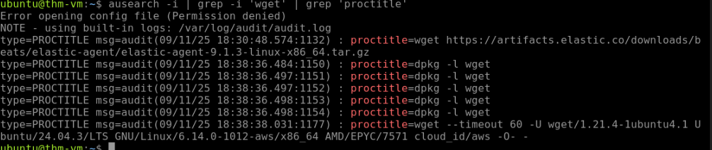
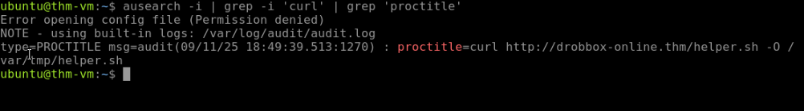
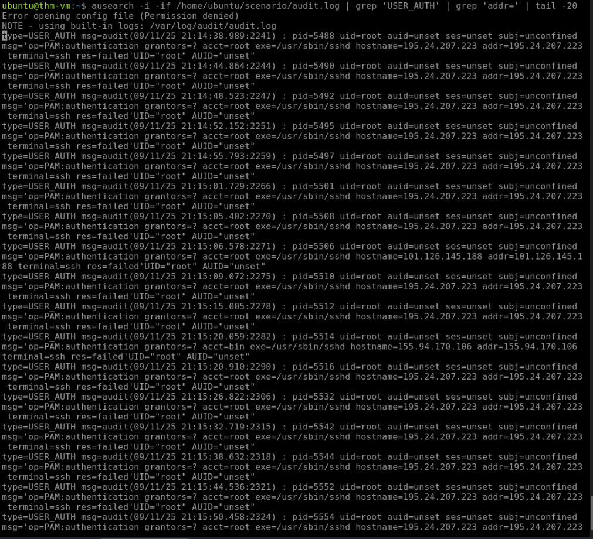
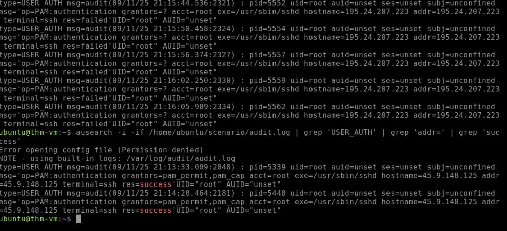
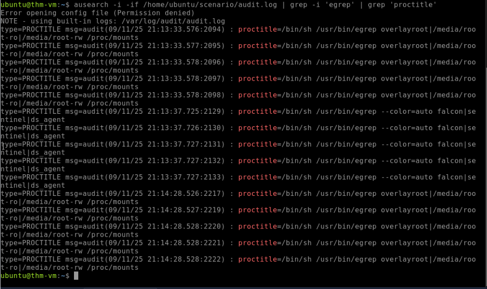
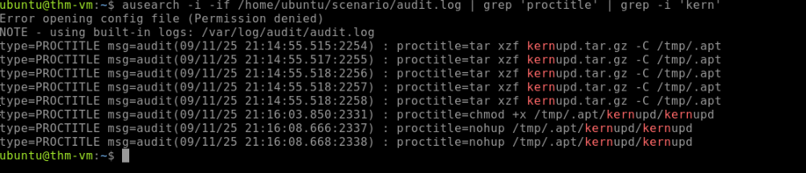
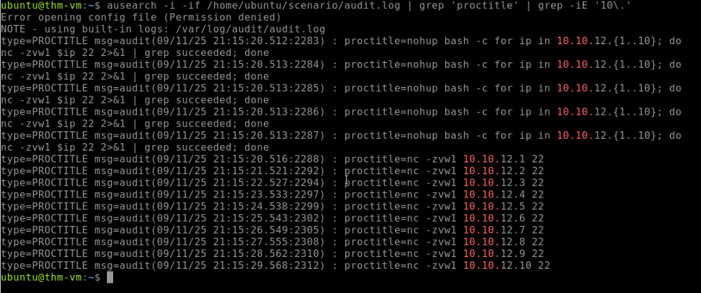

# Linux Intrusion Detection Lab

## Objective
This lab documents a forensic investigation of a full Linux intrusion 
using auditd and ausearch for log analysis. Working through a realistic 
attack scenario, the investigation traces a complete attack chain from 
initial SSH brute force through cryptominer deployment and internal 
network scanning for lateral movement. No SIEM or EDR was available — 
all analysis was performed using native Linux audit tools and command 
line investigation techniques.

---

## MITRE ATT&CK Coverage

| Technique | ID | Description |
|---|---|---|
| Brute Force | T1110 | SSH password brute force attack |
| Masquerading | T1036 | Malicious files named to mimic legitimate system tools |
| Command and Scripting Interpreter | T1059 | Bash and Python used for execution |
| Ingress Tool Transfer | T1105 | Malicious archive transferred to compromised host |
| Resource Hijacking | T1496 | Cryptominer deployed on compromised system |
| Security Software Discovery | T1518.001 | Attacker checked for EDR processes |
| Network Service Discovery | T1046 | Internal network scanned for open SSH ports |
| Remote Services | T1021 | Lateral movement via SSH scanning |

---

## Tools and Technologies

- **auditd** — Linux audit daemon for system call and event logging
- **ausearch** — Command line tool for querying auditd logs
- **Linux CLI** — grep, tail, and bash for log analysis and filtering
- **netcat (nc)** — Used by attacker for port scanning (identified in logs)
- **TryHackMe** — Linux Threat Detection 2 lab environment

---

## Lab Environment
```
┌─────────────────────────┐
│   Ubuntu Linux (AWS)    │
│   EC2 Instance          │
│   auditd logging active │
│   scenario/audit.log    │
└─────────────────────────┘
```

---

## Investigation Walkthrough

### Phase 1: Reconnaissance of the Environment

Before analyzing the attack, the environment was identified using:
```bash
systemd-detect-virt
```

Output: `amazon` — confirming the system is running on AWS EC2.

Running `ps aux` revealed a suspicious process consuming 60% CPU:
```bash
root 623 60.0 0.3 7744 3448 ? Rs 17:39 /bin/bash /var/lib/ultrasec/malscan
```

A bash script named `malscan` running as root with abnormally high 
CPU usage — a red flag even before examining the attack logs.

---

### Phase 2: Identifying Malicious Downloads

Two file download events were identified in the audit logs.

**Legitimate download — Elastic agent:**
```bash
ausearch -i | grep -i 'wget' | grep 'proctitle'
```



The `itsupport` user downloaded the official Elastic agent from 
`artifacts.elastic.co` — a legitimate IT activity.

**Malicious download — attacker script:**
```bash
ausearch -i | grep -i 'curl' | grep 'proctitle'
```



A curl command downloaded `helper.sh` from `drobbox-online.thm` — 
a typosquatting domain mimicking Dropbox. Key red flags:

- HTTP not HTTPS — no certificate validation
- Domain impersonating a legitimate service
- Shell script downloaded directly to `/var/tmp/helper.sh`
- Executed in context of the ubuntu user

---

### Phase 3: SSH Brute Force and Initial Access

The audit log was analyzed for SSH authentication events:
```bash
ausearch -i -if /home/ubuntu/scenario/audit.log | grep 'USER_AUTH' | grep 'addr=' | tail -20
```

**Brute force activity:**



Hundreds of `res=failed` authentication attempts from 
`195.24.207.223` targeting the root account in rapid succession — 
a clear SSH brute force attack mapping to **MITRE ATT&CK T1110**.

**Successful compromise:**



Following the brute force, two successful root authentications 
from `45.9.148.125` with `res=success`. This IP had no prior 
failed attempts — indicating the credentials obtained by the 
brute force were handed off to a separate attacker IP for clean 
access.

**This is a critical finding:** root SSH access was permitted on 
this system. Disabling root SSH login is a basic hardening step 
that would have prevented this compromise entirely.

---

### Phase 4: Post-Compromise Discovery

After gaining root access the attacker ran discovery commands 
to understand the environment. The attacker specifically searched 
for EDR and security tools:
```bash
ausearch -i -if /home/ubuntu/scenario/audit.log | grep -i 'egrep' | grep 'proctitle'
```



The attacker used egrep to search running processes for three 
EDR platforms:

- **falcon** — CrowdStrike Falcon
- **sentinel** — SentinelOne
- **ds_agent** — Trend Micro Deep Security

Finding no active EDR the attacker proceeded with the next phase. 
This maps to **MITRE ATT&CK T1518.001 Security Software Discovery**.

---

### Phase 5: Cryptominer Deployment
```bash
ausearch -i -if /home/ubuntu/scenario/audit.log | grep 'proctitle' | grep -i 'kern'
```



The attacker deployed a cryptominer using a three step process:

**Step 1 — Extract archive to hidden directory:**
```bash
tar xzf kernupd.tar.gz -C /tmp/.apt
```

**Step 2 — Make binary executable:**
```bash
chmod +x /tmp/.apt/kernupd/kernupd
```

**Step 3 — Launch with nohup to survive logout:**
```bash
nohup /tmp/.apt/kernupd/kernupd
```

**Masquerading techniques used:**
- Archive named `kernupd.tar.gz` to mimic a kernel update
- Extracted to `/tmp/.apt/` — hidden directory mimicking the 
  legitimate apt package manager
- `nohup` ensures the miner keeps running after the attacker 
  disconnects their SSH session

This maps to **MITRE ATT&CK T1036 Masquerading** and 
**T1496 Resource Hijacking**.

---

### Phase 6: Lateral Movement — Internal Network Scanning
```bash
ausearch -i -if /home/ubuntu/scenario/audit.log | grep 'proctitle' | grep -iE '10\.'
```



The attacker wrote a bash loop using netcat to scan the internal 
network for other systems with SSH exposed:
```bash
nohup bash -c for ip in 10.10.12.{1..10}; 
do nc -zvw1 $ip 22 2>&1 | grep succeeded; done
```

This scanned `10.10.12.1` through `10.10.12.10` on port 22, 
looking for additional systems to compromise using the same 
brute force technique. Maps to **MITRE ATT&CK T1046 Network 
Service Discovery** and **T1021 Remote Services**.

---

## Complete Attack Timeline

| Time | Event |
|---|---|
| 18:49 | Malicious helper.sh downloaded from drobbox-online.thm |
| 21:13 | SSH brute force begins from 195.24.207.223 |
| 21:13 | Attacker checks for EDR processes (falcon, sentinel, ds_agent) |
| 21:14 | Successful root login from 45.9.148.125 |
| 21:14 | kernupd.tar.gz extracted to /tmp/.apt/ |
| 21:14 | Cryptominer launched with nohup |
| 21:15 | Internal network scanned 10.10.12.1-10.10.12.10 |

---

## Key Findings

- Root SSH login was enabled — allowing direct root compromise 
  once credentials were brute forced
- Two separate IPs used — one for noisy brute force, one for 
  clean access — a common attacker operational security technique
- No EDR was present — attacker confirmed this before deploying 
  malware
- Cryptominer used multiple masquerading techniques to blend in 
  with legitimate system files
- Lateral movement began within one minute of cryptominer 
  deployment — indicating an automated or scripted attack chain

---

## SOC Skills Demonstrated

- Linux audit log analysis using auditd and ausearch
- Attack chain reconstruction from raw log data
- Process tree analysis for tracing command origins
- IOC identification — malicious domains, suspicious file paths, 
  anomalous process behavior
- MITRE ATT&CK technique mapping across full attack lifecycle
- Distinguishing legitimate activity from malicious activity 
  in the same log source
- Forensic investigation without SIEM or EDR tooling
